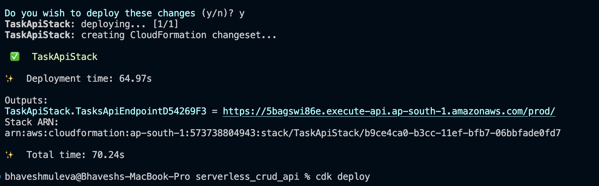
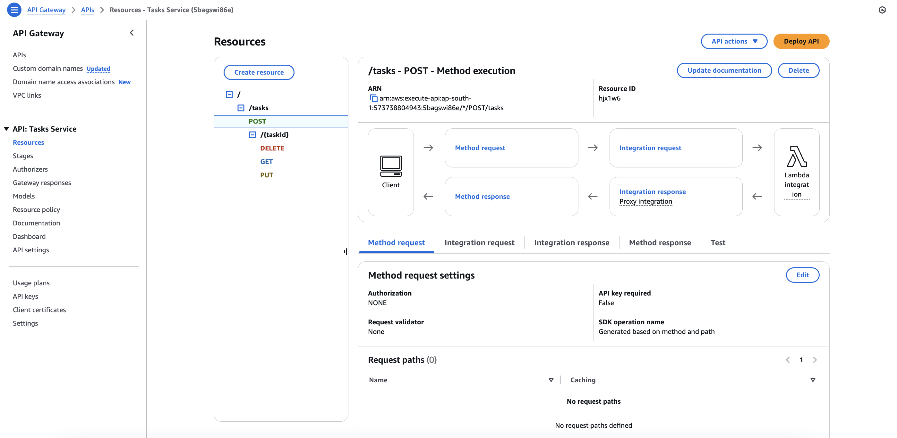
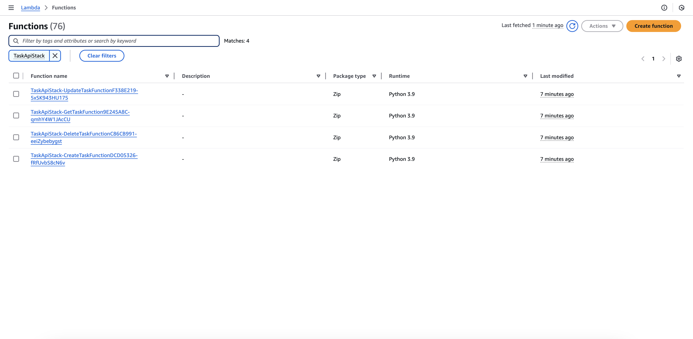
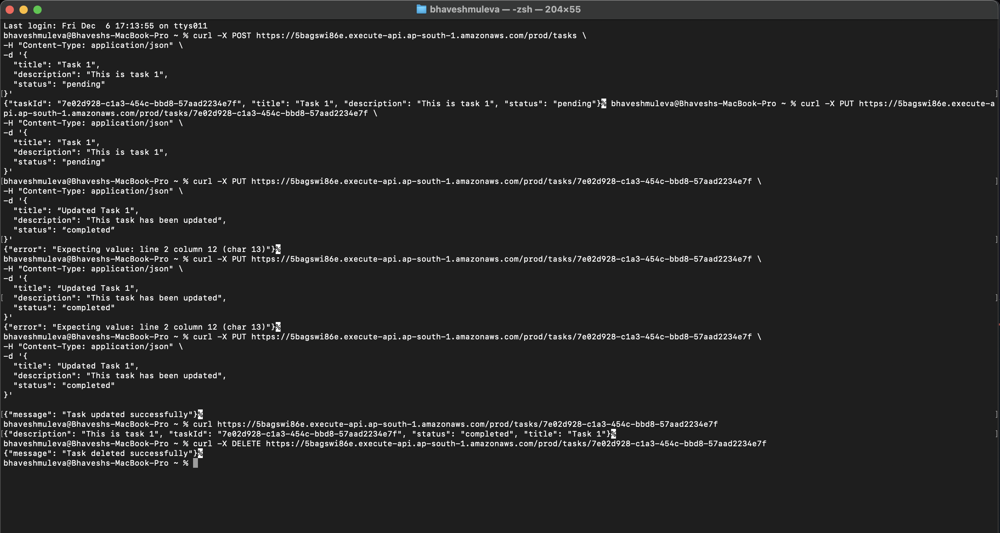

# Serverless CRUD API with AWS CDK

A serverless REST API built with AWS Lambda, API Gateway, and DynamoDB, deployed using AWS CDK. This API provides basic CRUD (Create, Read, Update, Delete) operations for managing tasks.

## 🏗️ Architecture

- **API Gateway**: REST API endpoint
- **Lambda Functions**: Serverless compute for handling CRUD operations
- **DynamoDB**: NoSQL database for storing tasks
- **AWS CDK**: Infrastructure as Code (IaC) for deployment

## 🚀 Prerequisites

1. [AWS Account](https://aws.amazon.com/)
2. [AWS CLI](https://aws.amazon.com/cli/) installed and configured
3. [Node.js](https://nodejs.org/) (v14.x or later)
4. [Python](https://www.python.org/) (v3.8 or later)
5. [AWS CDK](https://aws.amazon.com/cdk/) installed globally

## 📦 Installation

1. Clone the repository:
```
git clone https://github.com/yourusername/serverless-crud-api
cd serverless-crud-api
```

2. Create and activate a Python virtual environment:
```
python -m venv .venv
source .venv/bin/activate # On Windows, use: .venv\Scripts\activate
```

3. Install Python dependencies:
```
pip install -r requirements.txt
```

## 🛠️ Deployment

1. Bootstrap CDK (first-time only):
```
cdk bootstrap
```

2. Deploy the stack:
```
cdk deploy
```

After deployment: (don't use the same api gateway endpoint as this resource no longer exists)


check the lambda, api gateway, and dynamoDB in aws console:




After deployment, CDK will output the API Gateway endpoint URL.

## 🧪 Testing the API

### Using cURL

1. Create a task:
```
curl -X POST -H "Content-Type: application/json" -d '{"taskId": "1", "status": "pending"}' https://<api-gateway-endpoint>/tasks
```

2. Get a task:
```
curl https://<api-gateway-endpoint>/tasks/{taskId}
```

3. Update a task:
```
curl -X PUT -H "Content-Type: application/json" -d '{"status": "completed"}' https://<api-gateway-endpoint>/tasks/{taskId}
```

4. Delete a task:
```
curl -X DELETE https://<api-gateway-endpoint>/tasks/{taskId}
```

Testing Result:(don't use the same api gateway endpoint as this resource no longer exists)


## 🧹 Cleanup

To avoid incurring charges, delete the stack when you're done:
cdk destroy
